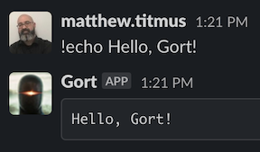
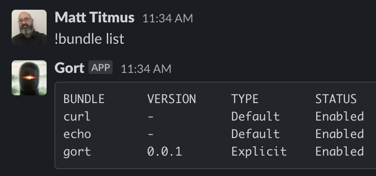

# Gort

[](https://godoc.org/github.com/getgort/gort)
[](https://github.com/getgort/gort/actions/workflows/test.yaml)
[](https://goreportcard.com/report/github.com/getgort/gort)

**This project is a work in progress under active heavy development. It is not production (or even alpha) ready! Follow for updates!**

Gort is a chatbot framework designed from the ground up for chatops.

Gort brings the power of the command line to the place you collaborate with your team: your chat window. Its open-ended command bundle support allows developers to implement functionality in the language of their choice, while powerful access control means you can collaborate around even the most sensitive tasks with confidence. A focus on extensibility and adaptability means that you can respond quickly to the unexpected, without your team losing visibility.

The official documentation can be found here: [The Gort Guide](http://guide.getgort.io/).

## Features

Gort's design philosophy emphasizes flexibility and security by allowing you to build commands in any language you want, using tooling you're already comfortable with, and can tightly control who can use them and how.

More specifically:

* Users may trigger commands through Slack (or another chat provider)
* Commands can be implemented in any programming language
* Commands are packaged into bundles that can be installed in Gort
* Organize users into groups, and permissions into roles
* Use a sophisticated identity and permission system to determine who can use commands
* Record all command activities in an audit log

Each of these is described in more detail below.

### Users may trigger commands through Slack (or another chat provider)

Users primarily interact with Gort through _commands_, which are triggered by a command characters (`!` by default), and are conceptually identical to commands entered on the command line.

For example, using an `echo` command might look like the following:



As shown, the output from successful commands is relayed back by Gort.

More information about commands can be found in the Gort Guide:

* [Gort Guide: Commands and Bundles](https://guide.getgort.io/commands-and-bundles.html)

### Commands can be implemented in any programming language

Gort [commands](https://guide.getgort.io/commands-and-bundles.html) are built as container images, which means you can build them in any language you're comfortable with.

What's more, because your executable receives all chat inputs exactly as if it was being typed on the command line, you can use any command line interpreter you want. Commands can even be implemented as Bash scripts, or using existing commands, like `curl`!

More information about writing commands can be found in the Gort Guide:

* [Gort Guide: Writing a Command Bundle](writing-a-command-bundle.md)

### Commands are packaged into bundles that can be installed in Gort

In Gort, a set of one or more related commands can be installed as a "command bundle".

A bundle is [represented in YAML](https://guide.getgort.io/bundle-configurations.html), specifying which executable to use for each command and who is allowed to execute each commands. 

A very simple bundle file is shown below.

```yaml
---
gort_bundle_version: 1

name: echo
version: 0.0.1
author: Matt Titmus <matthew.titmus@gmail.com>
homepage: https://guide.getgort.io
description: A test bundle.
long_description: |-
  This is an example bundle. It lets you echo text using the "echo"
  command that's built into Ubuntu 20.04.

permissions:
  - can_echo

docker:
  image: ubuntu
  tag: 20.04

commands:
  foo:
    description: "Echos back anything sent to it."
    executable: [ "/bin/echo" ]
    rules:
      - must have echo:can_echo
```

This shows a bundle called `echo`, which defines a command (also called `echo`) and a permission called `can_echo`. Once [installed](https://guide.getgort.io/managing-bundles.html), any user with the `echo:can_echo` permission can execute it in Slack.

More information about bundles can be found in the Gort Guide:

* [Gort Guide: Bundle Configurations](https://guide.getgort.io/bundle-configurations.html)
* [Gort Guide: Managing Bundles](https://guide.getgort.io/managing-bundles.html)

### Organize users into groups, and permissions into roles

In Gort, _users_ can be uniquely mapped to users in one or more chat providers. Gort users can be members of one or more _groups_, which in turn can have any number of _roles_ that can be thought of as collections of granted permissions. For example, the user `dave` might be in a group called `developers`. This group may have a role attached named `deployers` that contains a number of permissions, including one called `production_deploy`.

More information about permissions and rules can be found in the Gort Guide:

* [Gort Guide: User Management](https://guide.getgort.io/user-management.html)

### Use a sophisticated identity and permission system to determine who can use commands

A sophisticated rule system can be applied for each command defining who can use it. These can be quite granular, and are even capable of making permissions decisions based on the values of specific flags or parameters.

Rules are assigned at the bundle level, and can be quite sophisticated. Below we have a subset of a bundle called `deploy`.

```yaml
name: deploy
version: 0.0.1

permissions:
  - production_deploy

commands:
  deploy:
    description: "Deploys to the chosen environment."
    executable: [ "/bin/deploy" ]
    rules:
      - with arg[0] == "production" must have deploy:production_deploy
```

As you can see, the above example includes one command, also called `deploy`. Its one rule asserts that any user passing "production" as the parameter must have the `production_deploy` permission (from the `deploy` bundle).

More information about permissions and rules can be found in the Gort Guide:

* [Gort Guide: Permissions and Rules](https://guide.getgort.io/permissions-and-rules.html)
* [Gort Guide: Command Execution Rules](https://guide.getgort.io/command-execution-rules.html)

### Record all command activities in an audit log

All command activities are both emitted as high-cardinality log events (shown below) and recorded in [an audit log](https://guide.getgort.io/audit-log-events.html) that's maintained in Gort's database.

Take, for example, a user executing the `!bundle list` command from Slack:



This will generate log output similar to the following:

```
INFO   [49594] Triggering command   adapter.name=Gort bundle.default=false bundle.name=gort bundle.version=0.0.1
                                    command.executable="[/bin/gort bundle]" command.name=bundle
                                    command.params=list gort.user.name=admin provider.channel.id=C0238AZ9QNB
                                    provider.channel.name=gort-dev provider.user.email=matthew.titmus@gmail.com
                                    provider.user.id=U023P43L6PL trace.id=476b3089c8ce0d38a2915a3b58fde032
```

The above example uses "human readable" format for readability. In production mode Gort generates JSON-encoded log events.

More information about audit logging can be found in the Gort Guide:

* [Gort Guide: Audit Log Events](https://guide.getgort.io/audit-log-events.html)

<!-- - execute triggered commands anywhere a relay is installed using a tag-based targeting system, -->

<!-- ## Gort Design

A WIP design doc, including rough milestones (but not dates) [can be seen here](https://docs.google.com/document/d/1u7LzEzPjT1L8_xkHL577cKeuQdCiCQAww8M0rx1QXEM/edit?usp=sharing). Feel free to add questions or comments. -->

## How to Run the Gort Controller

For more information, take a look at the [Quick Start Guide](https://guide.getgort.io/quickstart.html) in [The Gort Guide](https://guide.getgort.io).

## The Gort Client

The `gort` binary also serves as the controller administration CLI.

### Configuring Client Profiles

The `gort` client uses a YAML-formatted configuration file, conventionally
located in the `profile` file in a `.gort` directory in your home directory.
This is where you can store connection credentials to allow `gort` to interact
with the Gort's Controller's REST API.

An example `.gort/profile` file might look like this:

```yaml
defaults:
    profile: gort

gort:
    url: https://gort.mycompany.com:4000
    password: "seekrit#password"
    user: me

preprod:
    url: https://gort.preprod.mycompany.com:4000
    password: "anotherseekrit#password"
    user: me
```

Comments begin with a `#` character; if your password contains a `#`,
surround the entire password in quotes, as illustrated above.

You can store multiple "profiles" in this file, with a different name
for each (here, we have `gort` and `preprod`). Whichever one is noted
as the default (in the `defaults` section) will be used by
`gort`. However, you can pass the `--profile=$PROFILE` option to
`gort` to use a different set of credentials.

While you can add profiles to this file manually, you can also use the
`gort profile create` command to help.

### Getting Help

The `gort` executable contains a number of commands and sub-commands.
Help is available for all of them by passing the `--help` option.
Start with `gort --help`, and go from there.

## Status of This Project

Gort is in a state of active heavy development. The date that various [milestones](TODO.md) have been achieved are listed below. The number and focus of present and future milestones are subject to change.

- Project created: 27 December 2018
- Milestone 1: 7 January 2019
- Milestone 2: 21 January 2019
- Milestone 3: 24 January 2019
- Milestone 4: 17 March 2019
- Milestone 5: 7 June 2021
- Milestone 6: 10 June 2021
- Milestone 7: 15 June 2021
- Milestone 8: 2 July 2021 (alpha.0); 8 July 2021 (alpha.1)
- Milestone 9: _TBD_
- Release candidate 1: _TBD_
- Release!: _TBD_

## More Links

* [Gort Slack Community](https://join.slack.com/t/getgort/shared_invite/zt-scgi5f7r-1U9awWMWNITl1MCzrpV3~Q)
* [GitHub Issues](https://github.com/getgort/gort/issues)

